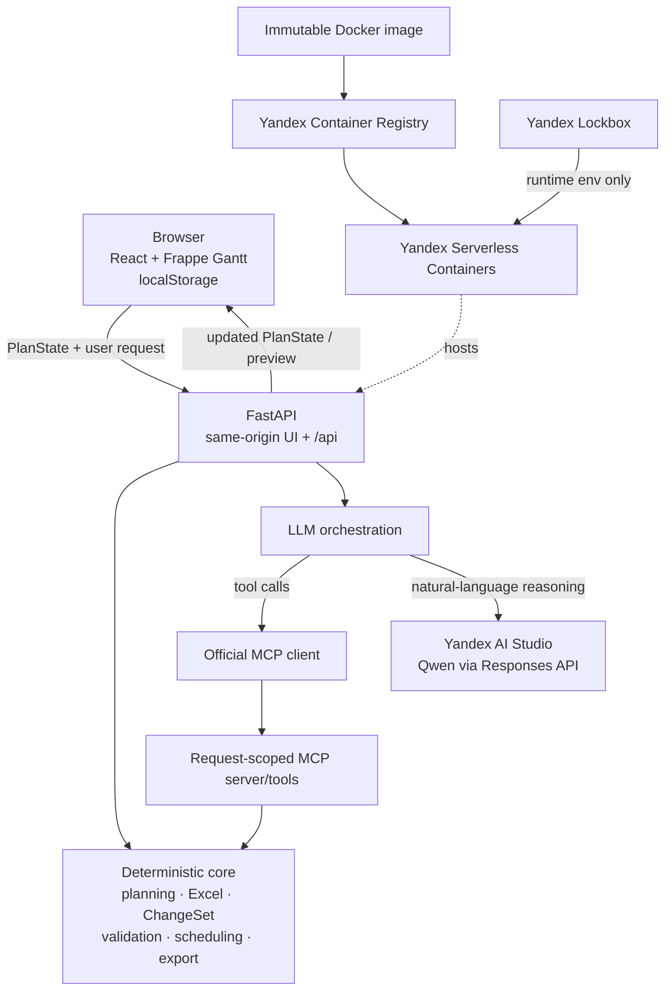

# Архитектура AI Gantt Planner

## Обзор

AI Gantt Planner разделяет смысловую интерпретацию пользовательской команды и
формальные правила планирования. Текущий план (`PlanState`) хранится в браузере и
передаётся FastAPI с каждым запросом. Backend проверяет даты, зависимости и
целостность плана по заданным правилам. LLM понимает естественный язык, но читает
план и подготавливает действия только через ограниченный набор MCP-инструментов,
доступных в рамках одного запроса.

## Как выполняется запрос

1. React загружает демонстрационный план или восстанавливает `PlanState` из
   `localStorage`.
2. Интерфейс отправляет актуальный план в FastAPI. Backend не хранит его между
   запросами.
3. При импорте Excel backend читает активный лист, проверяет строки и граф
   зависимостей, рассчитывает даты и подготавливает единый набор изменений
   (`ChangeSet`).
4. При работе с чатом FastAPI делает полученный план доступным MCP-серверу на
   время запроса. Модель читает нужные задачи и подготавливает только разрешённые
   действия через MCP-инструменты.
5. Backend сначала рассчитывает итоговый план после всех действий команды, а
   затем проверяет его целиком. Частично применённое промежуточное состояние не
   становится результатом запроса.
6. Если изменение сдвинет связанные задачи, frontend показывает текущие и
   предлагаемые даты. После выбора Apply исходный план и `ChangeSet` повторно
   проверяются backend.
7. Проверенный `PlanState` возвращается в браузер и сохраняется в `localStorage`.

## Границы ответственности

LLM определяет, что хочет пользователь, какие задачи он имеет в виду, какой
разрешённый MCP-инструмент нужен и когда следует задать уточняющий вопрос. Он
также формирует понятное объяснение результата. LLM не проверяет:

- даты и арифметику рабочих дней;
- целостность графа зависимостей, циклы и ссылку задачи на саму себя;
- структуру и содержимое Excel;
- возможность безопасно применить `ChangeSet` целиком и переносы связанных
  задач;
- допустимость неявного переноса, оптимизации или другого управленческого
  решения.

Такое разделение делает результат воспроизводимым: одинаковый `PlanState` и одна
и та же формальная операция дают одинаковые даты независимо от ответа модели.
Если изменение затрагивает другие задачи, LLM не может применить его
самостоятельно. Сначала пользователь подтверждает предварительный просмотр,
после чего backend ещё раз проверяет итоговый план.

## Компоненты

- `frontend/src` — React UI, Frappe Gantt adapter, preview overlays, browser
  persistence и API client.
- `backend/app/domain` — models, working-day calendar, graph, scheduling,
  validation, IDs и ChangeSet semantics.
- `backend/app/services` — deterministic Excel import/export, import planning,
  direct-edit и chat orchestration.
- `backend/app/mcp` — реальный official MCP client/server boundary и
  request-scoped context.
- `backend/app/ai` — provider abstraction и Qwen/OpenAI-compatible adapter.
- `infra/docker` и `infra/yandex` — проверяемый single-image delivery flow.

## Развёртывание и секреты

Multi-stage `Dockerfile` собирает React и переносит статические assets в Python
runtime image. FastAPI обслуживает SPA и `/api` из одного origin. Image с
immutable Git-SHA tag проходит через Yandex Container Registry в Yandex
Serverless Containers.

API credential не хранится в Git, image, frontend или `localStorage`. Yandex
Lockbox прикрепляет secret к revision как runtime environment variable. Public
URL открыт для reviewer без Yandex IAM authentication; это сознательное demo
ограничение, а не production security model.

## Сознательные ограничения MVP

- Хранение в `localStorage` упрощает демонстрацию, но план недоступен с другого
  устройства и не имеет общей истории или защиты от одновременного
  редактирования.
- Finish-to-Start и календарь Пн–Пт дают однозначный расчёт дат, но не учитывают
  праздники и другие типы зависимостей.
- Уникальные названия задач упрощают поиск предшественников из Excel. Стабильные
  внешние ID для полноценного повторного импорта оставлены в Roadmap.
- Предварительный просмотр важнее автоматической оптимизации: AI предлагает
  действие, а пользователь принимает решение о его последствиях.

Production-направления и порядок работ перечислены в
[`ROADMAP_TO_PRODUCTION.md`](ROADMAP_TO_PRODUCTION.md).
