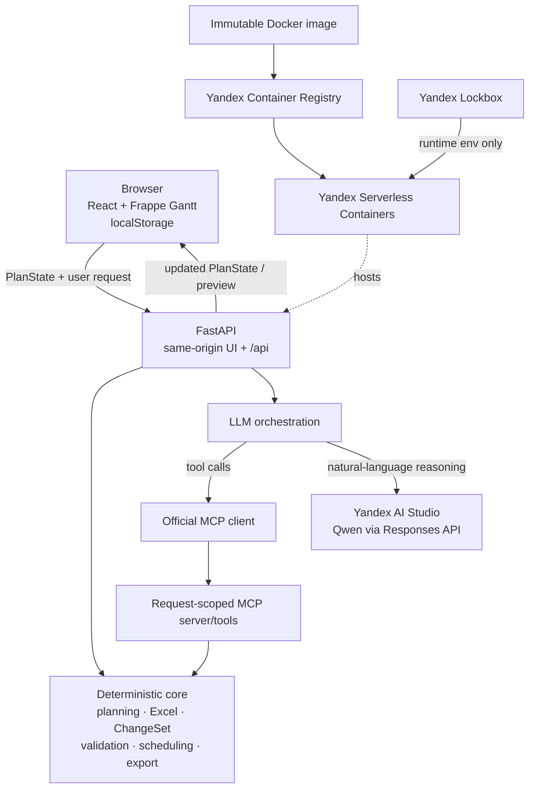

# Архитектура AI Gantt Planner

## Обзор

AI Gantt Planner разделяет смысловую интерпретацию пользовательской команды и
формальные правила планирования. Browser владеет текущим `PlanState`, FastAPI
детерминированно проверяет каждое изменение, а LLM может работать только через
ограниченный набор request-scoped MCP tools.

## Runtime flow

1. React загружает seed либо восстанавливает `PlanState` из `localStorage`.
2. UI отправляет актуальный snapshot в stateless FastAPI endpoint.
3. Для Excel backend самостоятельно читает active worksheet, проверяет строки и
   dependency graph, рассчитывает schedule и формирует единый ChangeSet.
4. Для chat orchestration публикует request-scoped plan через MCP. Модель читает
   нужные данные и подготавливает разрешённые operations через MCP tools.
5. Deterministic layer строит proposed final state, проверяет его целиком и
   классифицирует результат как auto-applicable либо confirmation-required.
6. Если есть impact, frontend показывает current/proposed geometry. Apply
   отправляет исходный plan и ChangeSet на повторную backend validation.
7. Новый snapshot возвращается browser и сохраняется локально; backend не хранит
   plan между запросами.

## Границы ответственности

LLM отвечает за natural-language understanding, intent, выбор разрешённого MCP
tool, аргументы и понятные человеку пояснения. Он не владеет:

- датами и арифметикой рабочих дней;
- целостностью dependency graph, cycle/self-reference checks;
- parsing или validation Excel;
- atomicity ChangeSet и impact propagation;
- неявным переносом, оптимизацией либо иным management decision.

Причина такого разделения — воспроизводимость и безопасность. Одинаковый
`PlanState` и одинаковая formal operation должны давать одинаковый результат
независимо от формулировки модели. LLM не может применить confirmation-required
ChangeSet: это разрешает только явный выбор пользователя, после которого backend
ещё раз валидирует итоговое состояние.

## Компоненты

- `frontend/src` — React UI, Frappe Gantt adapter, preview overlays, browser
  persistence и API client.
- `backend/app/domain` — models, working-day calendar, graph, scheduling,
  validation, IDs и ChangeSet semantics.
- `backend/app/services` — deterministic Excel import/export, import planning,
  direct-edit и chat orchestration.
- `backend/app/mcp` — реальный official MCP client/server boundary и
  request-scoped context.
- `backend/app/ai` — provider abstraction и Qwen/OpenAI-compatible adapter.
- `infra/docker` и `infra/yandex` — проверяемый single-image delivery flow.

## Deployment и secrets

Multi-stage `Dockerfile` собирает React и переносит статические assets в Python
runtime image. FastAPI обслуживает SPA и `/api` из одного origin. Image с
immutable Git-SHA tag проходит через Yandex Container Registry в Yandex
Serverless Containers.

API credential не хранится в Git, image, frontend или `localStorage`. Yandex
Lockbox прикрепляет secret к revision как runtime environment variable. Public
URL открыт для reviewer без Yandex IAM authentication; это сознательное demo
ограничение, а не production security model.

## Принятые MVP trade-offs

- Stateless backend и `localStorage` ускоряют reviewer demo, но не дают shared
  persistence, audit или concurrency control.
- Finish-to-Start и календарь Пн–Пт делают scheduling детерминированным, но не
  покрывают праздники и расширенные dependency types.
- Unique task names упрощают Excel predecessor resolution; стабильные external
  IDs для полноценного re-import оставлены в Roadmap.
- Preview-first ChangeSet flow важнее автоматической оптимизации: AI предлагает,
  пользователь принимает управленческое решение.

Production-направления и порядок работ перечислены в
[`ROADMAP_TO_PRODUCTION.md`](ROADMAP_TO_PRODUCTION.md).
